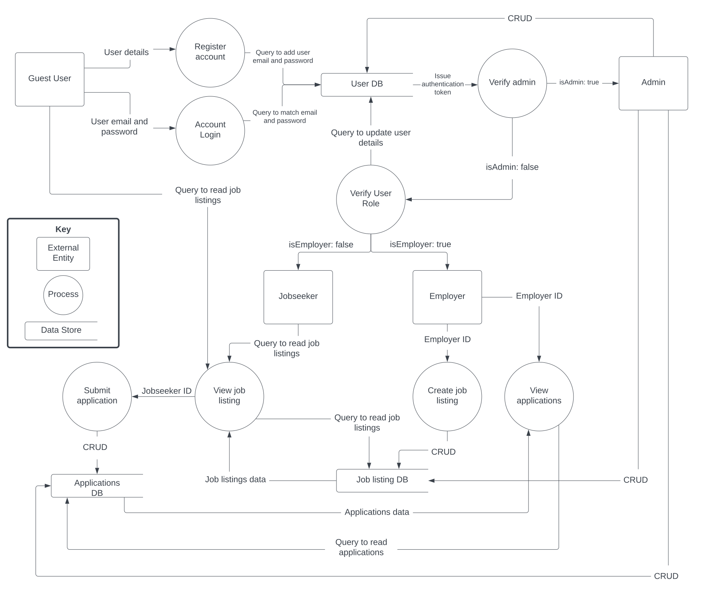

# Anthony Huynh - T3A2-A

## Table of Contents 

[**(R1) Description of website.**](#r1)

[**(R2) Dataflow Diagram**](#r2)

[**(R3) Application Architecture Diagram**](#r3)

[**(R4) User Stories**](#r4)

[**(R5) Wireframes**](#r5)

[**(R6) Trello Board**](#r6)

---

## (R1) 

---

**Purpose**

The purpose of this application is to tackle the issue of the rising unemployment rate in Australia by providing a centralized hub for both job seekers and employers to either find and apply for work or advertise job listings in order to find suitable staff. Jobseekers are able to filter and search through a variety of listings allowing for a larger scale job hunt operation. They are also provided with the ability to apply directly to the employer/recruitment officer enabling a much more efficient correspondence. Employers also benefit immensely as they are able to reach a wider audience of applicants, greatly improving the quality of their recruitment. Employers are able to post job listings or even contact jobseekers directly through their public profiles. We believe that our application will be an invaluable asset in uniting people who are seeking work with the businesses that need workers, with the ultimate goal of reducing the unemployment rate.

**Functionality/Features**

- Site navigation
- Search and view job listings
- Apply for job listings
- Post job listings
- View applications

Additional features if sufficient time
- Jobseeker profile so employers can search for jobseekers based on criteria
- Post and hire hireable services

**Target Audience**

This application is aimed towards people who are seeking employment as well as businesses which are looking for an efficient staffing solution. It is also aimed at individuals who provide hireable services such as lawn mowing or pet grooming.

**Tech Stack**

Front-end
- HTML
- CSS
- JavaScript
- React.js

Back-end
- Express.js
- Node.js

Database
- MongoDB

Deployment
- Netlify
- Railway

Testing
- Vitest
- Jest

Project Management
- Trello
- Discord

DevOp Tools
- Git
- Github
- VS Code

Design Tools
-  Lucidchart
-  Figma
-  Microsoft Paint

---

## (R2)

---

---

## (R3)

---

## (R4)

---

1. As a jobseeker, I want to be able to browse a variety of different job listings so that I can find a role which is suitable for me.
2. As a school student, I want to be able to search for different career paths so that I can have a better idea of what I want to pursue in life.
3. As a jobseeker, I want to be able to view and apply for job listings from the convenience of my own home so that I can spend my time efficiently.
4. As a small business owner I want to be able to advertise staff vacancies on a larger scale so that I can reach a greater audience of candidates.
5. As a recruiting manager for a large firm, I want to be able to sort candidates by qualifications and education level so that I can find suitable candidates to interview.
6. As a lawn mowing service provider, I want to be able to advertise my services on a platform so that I can promote my business.
7. As a university graduate, I want to be able to create a profile so that potential employers are able to find and contact me.

---

## (R5)

---

## (R6)

